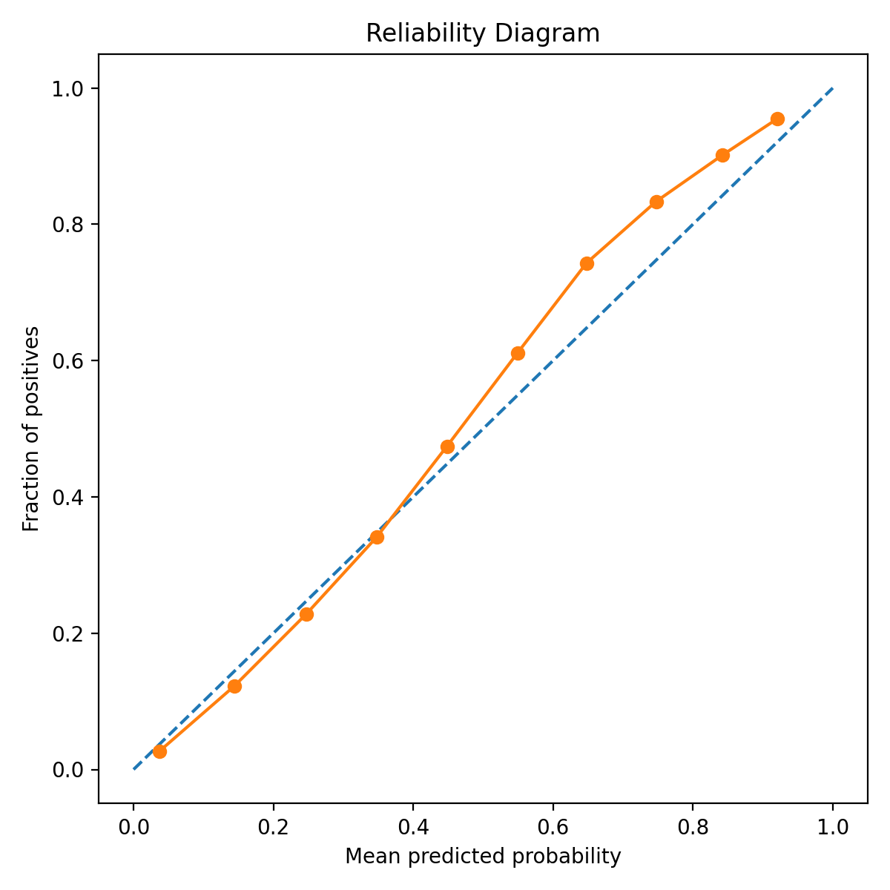
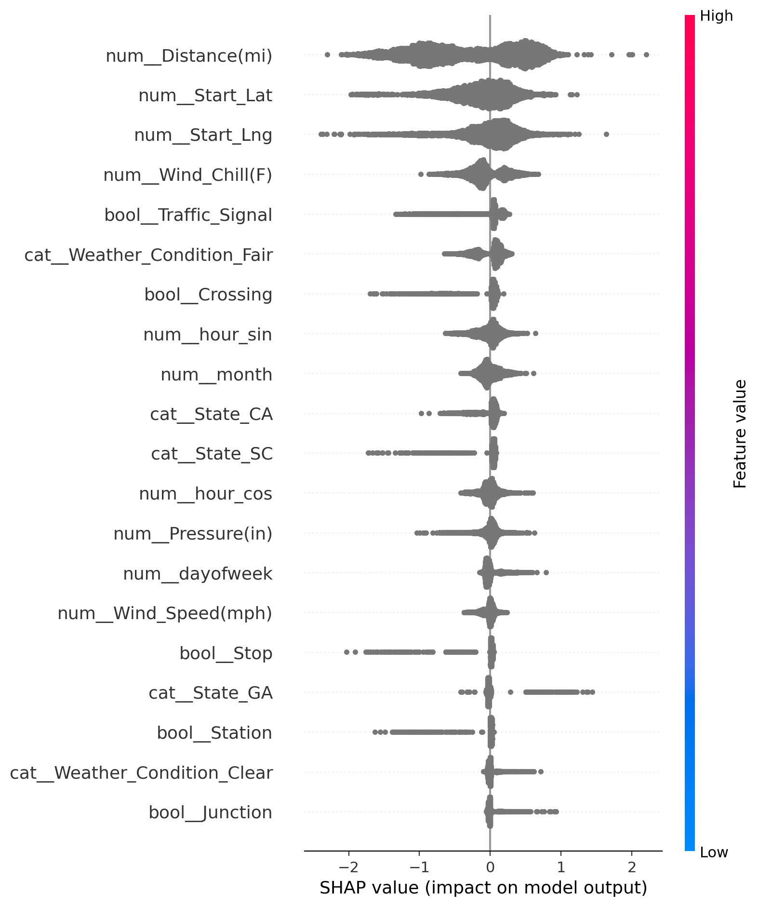

# XAI for Transportation Safety

**Option 2 - XAI Applications**  
**Rana Dubauskas & Anjali Kota**

This project trains an explainable machine learning model on the **US Accidents** dataset and focuses on transportation safety analysis with interpretable machine learning.

Transportation agencies increasingly rely on data-driven safety analysis, but many machine learning models are difficult to interpret. In safety-critical settings, decision-makers need more than a prediction alone. Explanations can help support trust, actionability, and stakeholder justification.


## Project Goal

This project uses the **US Accidents** dataset to build an explainable model for accident severity prediction using transportation, temporal, and environmental features.


The current task is:

- Predict whether an accident is **high severity**
- Target definition: `high_severity = 1` if `Severity >= 3`, else `0`
- Main model: **XGBoost**
- Explanations: **SHAP** summary plot and feature-importance output

This setup is designed to support transportation safety analysis with interpretable machine learning, while examining how environmental, roadway, and temporal features relate to accident severity.

## Project Background

This project is motivated by several challenges in transportation safety:

- separating true safety risk from traffic exposure
- handling correlated variables such as weather, traffic density, time of day, speed, and road type
- balancing model accuracy with interpretability for real users such as planners and safety personnel

A key gap in prior work is that many studies emphasize predictive performance and feature importance, but place less focus on whether explanations are useful for real transportation decision-making or whether they distinguish true hazards from high-volume exposure.

## Current Modeling Setup

The original proposal described a plan to use SHAP, ICE plots, counterfactual explanations, calibration metrics, and a logistic regression baseline. The current codebase implements the core part of that plan with:

- an **XGBoost** classifier
- predictive metrics
- calibration metrics
- **SHAP** explanations

The proposal’s evaluation plan specifically mentions:
- ROC-AUC
- calibration metrics
- logistic regression baseline comparison
- ICE plots
- global/local SHAP
- counterfactual explanations

At this stage, the code is focused on the main XGBoost + SHAP pipeline first, with some of the optional extensions left for future improvement.

## Dataset

This project uses the **US Accidents** dataset from Kaggle.

Expected file location:

```text
data/US_Accidents_March23.csv
```

Dataset link:

```text
https://www.kaggle.com/datasets/sobhanmoosavi/us-accidents
```

## Project Structure

```text
project/
├── data/
│   └── US_Accidents_March23.csv
├── artifacts/
│   ├── metrics.json
│   ├── reliability_diagram.png
│   ├── test_predictions.csv
│   ├── shap_summary.png
│   ├── shap_feature_importance.csv
│   ├── top_risk_cases.csv
│   └── xgb_pipeline.joblib
├── train_xai_us_accidents.py
├── requirements.txt
├── README.md
└── .gitignore
```

## How to Run

### 1. Create and activate a virtual environment

#### macOS / Linux

```bash
python3 -m venv .venv
source .venv/bin/activate
```

#### Windows PowerShell

```powershell
python -m venv .venv
.venv\Scripts\Activate.ps1
```

### 2. Install Dependencies

```bash
pip install -r requirements.txt
```

### 3. Download the Dataset
1. Go to dataset [link](https://www.kaggle.com/datasets/sobhanmoosavi/us-accidents)
2. Scroll down to `US_Accidents_March23.csv`, select all 46 columns, and click download


### 4. Move the Dowloaded Dataset file in the `data` folder

Expected path:

```text
data/US_Accidents_March23.csv
```

### 5. Run the Training Script

```bash
python train_xai_us_accidents.py
```

## What the Script Does

The script:

- loads the US Accidents dataset
- creates time-based features from `Start_Time`
- creates the binary target `high_severity`
- selects numeric and categorical transportation/environmental features
- trains an XGBoost classifier
- evaluates the model with predictive and calibration metrics
- saves SHAP explanation outputs

This reflects the project’s broader goal of combining predictive modeling with explanation methods that make transportation safety analysis more understandable and actionable. The proposal specifically emphasizes global and local SHAP explanations and asks whether risk is driven by structural or environmental factors versus confounding factors.

## Outputs

After running, the script saves results in the `artifacts/` folder:

- `metrics.json`
- `reliability_diagram.png`
- `test_predictions.csv`
- `xgb_pipeline.joblib`
- `shap_summary.png`
- `shap_feature_importance.csv`
- `top_risk_cases.csv`

### Pre-trained Model

A trained XGBoost pipeline is saved in:

```text
artifacts/xgb_pipeline.joblib
```

This allows users to inspect or reuse the trained model without retraining from scratch.

## Results

*All images and artifacts can be found in the `artifacts/` folder.*

The final XGBoost model shows strong predictive performance, improved ranking quality over the earlier run, and good overall calibration on the high-severity accident prediction task.

### Quantitative Results

| Metric | Value |
|---|---:|
| ROC-AUC | 0.8885 |
| PR-AUC | 0.6866 |
| F1 | 0.5794 |
| Precision | 0.7385 |
| Recall | 0.4767 |
| Brier Score | 0.0977 |
| ECE | 0.0216 |

### Analysis

- The model achieves a **ROC-AUC of 0.8885**, indicating strong ability to distinguish higher-severity from lower-severity accidents.
- The **PR-AUC of 0.6866** shows solid precision-recall performance for the positive class.
- The model maintains **high precision (0.7385)** with improved **recall (0.4767)**, meaning it is still somewhat conservative but identifies more true high-severity cases than the earlier run.
- The **Brier score (0.0977)** indicates strong probability quality overall.
- The **ECE (0.0216)** is still low, suggesting that predicted probabilities remain reasonably well calibrated, although calibration is slightly worse than in the earlier smaller-sample run.

### Reliability Diagram

The reliability diagram shows that predicted probabilities continue to track observed frequencies closely overall. The calibration curve stays near the diagonal, with some overestimation in the mid-to-high probability range, but the model still produces probabilities that are fairly reliable for decision support.



### SHAP Summary Plot

The SHAP summary plot highlights which features most strongly influence the model’s predictions. The most important global features are `Distance(mi)`, `Start_Lat`, `Start_Lng`, `Wind_Chill(F)`, `Traffic_Signal`, `Weather_Condition_Fair`, and `Crossing`. Additional influential features include time-based variables such as `hour_sin`, `month`, `hour_cos`, and `dayofweek`, as well as roadway-context variables such as `Stop`, `Station`, and `Junction`. :contentReference[oaicite:0]{index=0}



### High-Risk Predictions

A few representative high-confidence predictions from the test set include:

| State | Distance (mi) | Weather | Junction | Traffic Signal | Crossing | y_true | y_prob | y_pred |
|---|---:|---|---:|---:|---:|---:|---:|---:|
| IL | 0.332 | Overcast | 0 | 1 | 1 | 1 | 0.9749 | 1 |
| IL | 0.000 | Cloudy | 1 | 1 | 1 | 1 | 0.9748 | 1 |
| IL | 0.552 | Overcast | 0 | 0 | 0 | 1 | 0.9743 | 1 |

These examples show that the model can assign very high predicted probabilities to true high-severity accidents under certain combinations of roadway context, weather conditions, and temporal patterns. :contentReference[oaicite:1]{index=1}

### Key Takeaways

- The full-data run improves on the earlier subset-based run across **ROC-AUC, PR-AUC, F1, precision, recall, and Brier score**.
- The model is particularly strong at **ranking severity risk** and still produces **reasonably calibrated probabilities**.
- **Transportation and roadway-context features** such as traffic signals, crossings, stops, and junction indicators contribute meaningfully to predictions.
- **Environmental and temporal factors** such as wind chill, weather condition, month, and time-of-day patterns also influence severity predictions.
- SHAP improves interpretability by showing which transportation, environmental, spatial, and temporal features are most associated with high-severity outcomes.

### Interpretation

From the SHAP importance output, the strongest contributors to the model’s prediction of whether an accident is high severity are:

1. **Length of roadway affected by the accident:** `Distance(mi)`
2. **Spatial location:** `Start_Lat` and `Start_Lng`
3. **Environmental conditions:** `Wind_Chill(F)` and weather-condition features
4. **Roadway context:** `Traffic_Signal`, `Crossing`, `Stop`, and `Junction`
5. **Time-related features:** `hour_sin`, `hour_cos`, `month`, and `dayofweek`
6. **Regional indicators:** state features such as `CA`, `SC`, `GA`, and `IL`

The SHAP results show that the model’s severity predictions are influenced by a mix of transportation, environmental, temporal, and spatial factors. In particular, roadway-control features, weather-related variables, and timing effects all appear among the most important drivers, which supports the project goal of using explainable AI to understand how transportation and environmental context relate to accident severity. At the same time, the strong influence of spatial variables suggests that geographic patterns are also an important part of the model’s predictive signal. Top SHAP features from the final run include `Distance(mi)`, `Start_Lat`, `Start_Lng`, `Wind_Chill(F)`, `Traffic_Signal`, `Weather_Condition_Fair`, `Crossing`, `hour_sin`, `month`, and `State_CA`. :contentReference[oaicite:2]{index=2}

## Common Issues

### 1. File not found error

Make sure the dataset is exactly here:

```text
data/US_Accidents_March23.csv
```

### 2. Package not found

Make sure the virtual environment is activated before running:

```bash
source .venv/bin/activate
```

Then reinstall dependencies:

```bash
pip install -r requirements.txt
```

### 3. Script is too slow or runs out of memory

Open `train_xai_us_accidents.py` and reduce:

```python
SAMPLE_SIZE = 300_000
```

Try values like:

```python
SAMPLE_SIZE = 50000
```

or

```python
SAMPLE_SIZE = 100000
```

### 4. SHAP step is slow

This is normal on larger samples. The script already limits the SHAP subset, but reducing `SAMPLE_SIZE` can still help.

## Future Improvements

Useful extensions if you want a stronger final project:

- add a logistic regression baseline
- add random forest comparison
- filter to junction-related accidents only
- add SHAP waterfall plots for individual cases
- add calibration methods such as isotonic regression or Platt scaling
- add ICE plots
- add counterfactual explanations

These extensions are directly aligned with the original proposal’s evaluation plan and solution vision.

